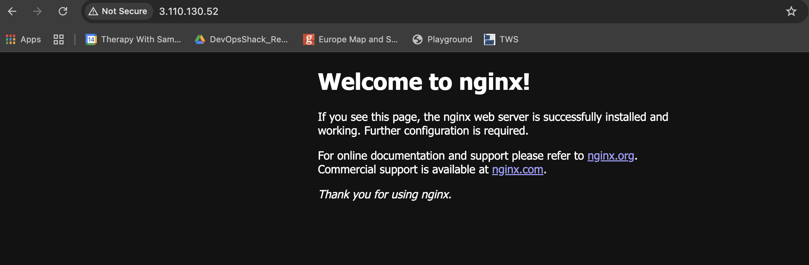

## Guidelines

1. Explain SSH concept 
SSH has two sides: the client (machine trying to connect) and the server (machine accepting the connection).
The rule is: the client’s PUBLIC key goes into the server’s authorized_keys file.
authorized_keys is simply the list of public keys that are allowed to log into that server.
The PRIVATE key always stays on the client machine and is never shared.
Easy trick: “Whoever wants to enter gives their PUBLIC key to the door they want to open.”

Suppose: Server A wants to SSH into Server B.
Server A generates:
id_rsa (private key)
id_rsa.pub (public key)

You copy the contents of id_rsa.pub to: ~/.ssh/authorized_keys on Server B.

Now when Server A runs: ssh user@server-b

Server B checks: "Do I have this public key in my authorized_keys file?"

If yes, Server A proves it possesses the matching private key, and access is granted.

---------------------------------------------------------------------------------------------------
### Part 1: Launch Cloud Instance & SSH Access (15 minutes)

**Step 1: Create a Cloud Instance**
create via aws and download the pem key 

**Step 2: Connect via SSH**

1. create the aws instance and download the pem.key
2. ssh into instance a and instance b 
chmod 400 "server-a.pem"
chmod 400 "server-b.pem"

ssh -i "server-a.pem" ubuntu@ec2-3-110-130-52.ap-south-1.compute.amazonaws.com  --> server a
ssh -i "server-b.pem" ubuntu@ec2-3-112-135-53.ap-south-1.compute.amazonaws.com --> server b 

3. usecase - ssh to b from server a
- run ssh-keygen command on server a to generate a public key 
- copy the public key generated on server a into the authorized_keys file of server b --> cd ~./ssh ; vim authorized_keys (this file is meant to contain only public keys)
- from server a --> ssh -i ~/.ssh/id_ed25519 ubuntu@ec2-3-112-135-53.ap-south-1.compute.amazonaws.com


---

### Part 2: Install Docker & Nginx (20 minutes)

**Step 1: Update System**
sudo apt update
sudo apt upgrade -y

**Step 2: Install Nginx**
sudo apt install nginx -y

**Verify Nginx is running:**
sudo systemctl status nginx
---

### Part 3: Security Group Configuration (10 minutes)

**Test Web Access:**
Open browser and visit: `http://<your-instance-ip>`

You should see the **Nginx welcome page**!


📸 **Screenshot this page** - you'll need it for submission
- run ss - tunlp to find out which port nginx is running on 
    ubuntu@ip-172-31-46-159:/var/log/nginx$ sudo ss -tulpn | grep nginx
tcp   LISTEN 0      511               0.0.0.0:80        0.0.0.0:*    users:(("nginx",pid=51283,fd=5),("nginx",pid=51282,fd=5),("nginx",pid=51279,fd=5))

- add port 80 in inbound rules (since nginx sits inside the server so the request is hitting the server) of your ec2 security group allowing all traffic 0.0.0.0/0 tcp protocol (security groups operate that the transport layer) 

In secutiry groups tcp traffic is interpreted as http/https
HTTP
  ↓
runs on
  ↓
TCP Port 80

HTTPS
  ↓
runs on
  ↓
TCP Port 443


---

### Part 4: Extract Nginx Logs (15 minutes)

**Step 1: View Nginx Logs**
cd /var/log/nginx
**Step 2: Save Logs to File**
cp error.log nginx-logs.txt
**Step 3: Download Log File to Your Local Machine**
```bash
# On your local machine (new terminal window)
# For AWS:
scp -i your-key.pem ubuntu@<your-instance-ip>:~/nginx-logs.txt .

# For Utho:
scp root@<your-instance-ip>:~/nginx-logs.txt .
```

---