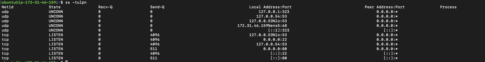

## Quick Concepts (write 1–2 bullets each)
- OSI layers (L1–L7) vs TCP/IP stack (Link, Internet, Transport, Application) 
Please Do Not Throw Sausage Pizza Away
at the senders end - 
| Layer | What it Does | WhatsApp Example |
|--------|-------------|------------------|
| **7. Application** | App you interact with | You type **"Hi"** and tap **Send** in WhatsApp. |
| **6. Presentation** | Formats and encrypts data | WhatsApp encrypts the message so only your friend can read it. |
| **5. Session** | Manages the conversation | WhatsApp keeps your chat session active with your friend. |
| **4. Transport** | Ensures reliable delivery | TCP makes sure the message reaches the server correctly. |
| **3. Network** | Finds where to send the data | IP addresses route the message across the internet. |
| **2. Data Link** | Sends data to the next device on the local network | Your phone sends the data to your Wi-Fi router using MAC addresses. |
| **1. Physical** | Moves actual signals | The message travels as Wi-Fi radio waves from your phone to the router. |
in recievers end all of the above happens in opposite order 

- Where **IP**, **TCP/UDP**, **HTTP/HTTPS**, **DNS** sit in the stack
IP - network layer 
TCP/UDP - Transport layer 
HTTP/HTTPS - application layer 
DNS - application layer 
- One real example: “`curl https://example.com` = App layer over TCP over IP”

---

## Hands-on Checklist (run these; add 1–2 line observations)
- **Identity:** `hostname -I` (or `ip addr show`) — note your IP.\
172.31.46.159

- **Reachability:** `ping <target>` — mention latency and packet loss.
ubuntu@ip-172-31-46-159:~$ ping google.com
PING google.com (142.250.143.138) 56(84) bytes of data.
64 bytes from pt-in-f138.1e100.net (142.250.143.138): icmp_seq=1 ttl=113 time=2.29 ms
64 bytes from pt-in-f138.1e100.net (142.250.143.138): icmp_seq=2 ttl=113 time=1.88 ms
15 packets transmitted, 15 received, 0% packet loss, time 14024ms
rtt min/avg/max/mdev = 1.884/2.159/2.416/0.213 ms

- **Path:** `traceroute <target>` (or `tracepath`) — note any long hops/timeouts.
ubuntu@ip-172-31-46-159:~$ traceroute google.com
traceroute to google.com (142.250.76.206), 30 hops max, 60 byte packets
 1  242.6.253.3 (242.6.253.3)  1.732 ms 242.6.253.1 (242.6.253.1)  1.433 ms 242.6.253.7 (242.6.253.7)  7.494 ms
 2  * * *
 3  * * 99.82.178.53 (99.82.178.53)  1.302 ms
 4  * * *
 5  142.250.210.182 (142.250.210.182)  1.692 ms 172.253.77.20 (172.253.77.20)  1.955 ms 142.250.214.100 (142.250.214.100)  2.815 ms
 6  142.250.209.70 (142.250.209.70)  2.217 ms 172.253.177.30 (172.253.177.30)  2.132 ms 172.253.177.90 (172.253.177.90)  1.519 ms
 7  192.178.110.109 (192.178.110.109)  2.594 ms bom12s10-in-f14.1e100.net (142.250.76.206)  1.772 ms  1.587 ms

- **Ports:** `ss -tulpn` (or `netstat -tulpn`) — list one listening service and its port.

- **Name resolution:** `dig <domain>` or `nslookup <domain>` — record the resolved IP.
ubuntu@ip-172-31-46-159:~$ nslookup google.com
Server:		127.0.0.53
Address:	127.0.0.53#53

Non-authoritative answer:
Name:	google.com
Address: 142.250.76.206

- **HTTP check:** `curl -I <http/https-url>` — note the HTTP status code.
ubuntu@ip-172-31-46-159:~$ curl -I google.com
HTTP/1.1 301 Moved Permanently
Location: http://www.google.com/
Content-Type: text/html; charset=UTF-8
Content-Security-Policy-Report-Only: object-src 'none';base-uri 'self';script-src 'nonce-ztG6QiaOjMv4IGbS4-L54Q' 'strict-dynamic' 'report-sample' 'unsafe-eval' 'unsafe-inline' https: http:;report-uri https://csp.withgoogle.com/csp/gws/other-hp
Date: Mon, 01 Jun 2026 18:09:09 GMT
Expires: Wed, 01 Jul 2026 18:09:09 GMT
Cache-Control: public, max-age=2592000
Server: gws
Content-Length: 219
X-XSS-Protection: 0
X-Frame-Options: SAMEORIGIN

- **Connections snapshot:** `netstat -an | head` — count ESTABLISHED vs LISTEN (rough).

Pick one target service/host (e.g., `google.com`, your lab server, or a local service) and stick to it for ping/traceroute/curl where possible.

---

## Mini Task: Port Probe & Interpret
1) Identify one listening port from `ss -tulpn` (e.g., SSH on 22 or a local web app).  
ssh on 22
http on 80

2) From the same machine, test it: `nc -zv localhost <port>` (or `curl -I http://localhost:<port>`).  
ubuntu@ip-172-31-46-159:~$ nc -zv localhost 22
Connection to localhost (127.0.0.1) 22 port [tcp/ssh] succeeded!
ubuntu@ip-172-31-46-159:~$ nc -zv localhost 80
Connection to localhost (127.0.0.1) 80 port [tcp/http] succeeded!

3) Write one line: is it reachable? If not, what’s the next check? (e.g., service status, firewall).
systemctl ssh status 
sudo ufw status

## Reflection (add to your markdown)
- Which command gives you the fastest signal when something is broken?
curl

- What layer (OSI/TCP-IP) would you inspect next if DNS fails? If HTTP 500 shows up?
application layer 

- Two follow-up checks you’d run in a real incident.
First I'd use curl to see the exact failure. Then I'd verify DNS resolution using dig or nslookup, and check network connectivity to the target port using nc or telnet. This helps determine whether the issue is DNS, network connectivity, or the application itself.